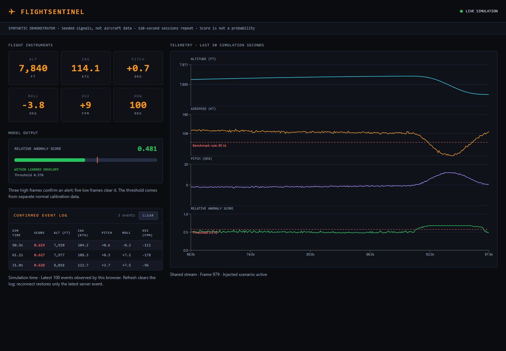

# FlightSentinel

**Public CV demo:** https://diogofernandes.github.io/flightsentinel/

The public link opens the actual React dashboard in clearly labelled recorded-replay mode.
Its readings, scores and confirmed alerts come from the saved Python model run.
GitHub Pages hosts static files, so this version does not run the Python backend.
The complete live application remains available through the local setup below or the Render deployment.

A synthetic telemetry demonstrator built with **React, FastAPI and scikit-learn**.
One server-side simulation produces a shared stream at a target 10 Hz.
An Isolation Forest scores each frame; confirmed alerts and live charts appear in
a cockpit-inspired browser dashboard.

**This is a portfolio experiment, not avionics, a validated stall detector, or
software for operational flight decisions.** It uses generated signals only.



The portfolio includes [Demo & results](docs/index.html) and a recruiter-facing [Project explained](docs/about.html) page covering the architecture, model choice, training, evaluation and limitations.

## Run locally

Requirements: Python **3.12** and Node.js **22.12+** (or 20.19+). Run from the repository root in
Linux/WSL. Backend dependencies have exact direct version pins; the frontend has
an npm lockfile. On Ubuntu, install the matching python3-venv package if ensurepip is unavailable.

```bash
python3 -m venv .venv
source .venv/bin/activate
# Windows PowerShell: .venv\Scripts\Activate.ps1
python -m pip install -r requirements-dev.txt
cd frontend
npm ci
npm run build
cd ..
python -m uvicorn backend.main:app --host 127.0.0.1 --port 8000
```

Open **http://localhost:8000**. The backend trains and calibrates at startup and
serves the built frontend. Use a **single server worker**: each process owns an
independent simulation. For access from another host, bind explicitly to
`0.0.0.0`; this demonstrator has no authentication.

For frontend development, run the backend, then in another terminal:

```bash
cd frontend
npm run dev
```

Open http://localhost:5173. Vite proxies WebSockets to the backend.
Production uses a same-origin `ws://` or `wss://` connection. An optional
`VITE_TELEMETRY_URL=wss://your-host/ws/telemetry` build-time variable supports a
separate backend; an HTTPS page rejects insecure WebSockets. Use the backend,
rather than Vite's static preview, to serve the complete application.

## What the demo actually does

- Displays altitude, airspeed, pitch, roll, vertical speed and heading.
- Scores **airspeed, pitch, roll and vertical speed**. Absolute altitude and heading
  are display-only: a different cruising altitude is not inherently abnormal.
- Injects an eight-second combined descent scenario every 30 simulation seconds
  with smooth entry/recovery. Evaluation also exercises bank-only and airspeed-only
  deviations at full and half severity.
- Integrates reported VSI into altitude, keeping vertical displacement consistent.
  Other channels are illustrative signals, not an aircraft dynamics model.
- Uses independent seeded random generators to make runs repeatable.
- Calibrates the threshold on the **99.5th percentile of separate normal data**.
  Higher scores mean more unusual under this model, **not anomaly probability**.
- Confirms alerts after three high frames; clears them after five low frames
  with 0.03 hysteresis. Stable server event IDs avoid reconnect duplicates.
- Hides readings when disconnected or stale and retries with backoff.
- Repeats a finite **120-second demonstration session**, explicitly resetting the
  session ID, simulation clock and observed event log rather than descending indefinitely.
- Keeps up to 300 chart frames and 100 observed events in the browser.
  Logs are not persisted; missed events are not fully recoverable.

There is no Qt application, PyTorch wrapper, TCP ingestion bridge, saved model
artifact or real avionics integration in this repository.

## Architecture

```text
FastAPI lifespan
  ├─ Train on normal seed 42
  ├─ Calibrate on normal seed 43
  └─ One paced producer task
       ├─ TelemetrySimulator → frame
       ├─ Isolation Forest inference in a background thread
       ├─ Alert confirmation / event IDs
       └─ Bounded per-client queues
            └─ WebSocket → validated React state → readouts / charts / event log
```

Adding viewers does not advance the simulator. Slow clients get the latest frame,
not an unbounded backlog. Monotonic deadlines compensate for inference time;
overruns are reported by `GET /health`. This is a **target rate**, not a hard
real-time guarantee. Under sustained overload, simulation time lags wall-clock
time. Sequence numbers and session IDs identify a server run.

## Evidence and limitations

The evaluation compares ML with illustrative limits: airspeed < 85 kt,
|roll| > 25°, pitch > 8°, or VSI < −500 ft/min. These are benchmark rules,
not aircraft operating limits.

See the [complete evaluation](docs/evaluation.md) and [raw results](docs/evaluation.json).
Training/calibration seeds are separate from test seeds 101–103.
Held-out noise seeds still share the generator and nominal envelope:
these results **do not establish real-world generalization**.

The model performs better on the combined deviation than on isolated bank or
airspeed changes. The rule baseline detects many obvious isolated deviations
more reliably. This is a measured limitation, not a claim that ML replaces
flight-envelope rules.

The [portfolio page](docs/index.html) replays a scored synthetic recording.
It is explicitly labeled a recording and does not run browser inference.
Regenerate the report and recording together:

```bash
python -m backend.evaluate --replay
```

Timing depends on the machine. Regenerate results after changing dependencies,
generator settings or model parameters.

## Verification

```bash
python -m pytest tests -q
cd frontend
npm test
npm run build
```

GitHub Actions runs backend tests/evaluation and frontend tests/build.

| Requirement | Verification |
|---|---|
| Seeded runs repeat; altitude agrees with VSI | Simulator regression test |
| Training and threshold repeat | Deterministic detector test |
| Nominal holdout raw false-positive rate stays below 2% | Synthetic regression budget |
| Combined deviation produces a confirmed alert | Detector scenario test |
| Invalid / non-finite data fails explicitly | Backend and frontend validation tests |
| Viewers share one timeline; slow clients stay bounded | Producer and WebSocket tests |
| Health detects producer failure; disconnect removes subscribers | Lifecycle tests |
| Stale data reconnects; disposal stops retries | Frontend transport tests |

This is ordinary demonstrator verification, not DO-178C compliance or certification.

### Optional browser smoke check

The reusable script checks the actual desktop/mobile dashboard, an induced
connection outage, four rendering charts, and the portfolio recording. It also
refreshes the screenshots after observing a complete model alert.

With the backend running on port 8000 and a static docs preview on port 8090:

```bash
# Optional tooling, not required to run the application:
cd frontend
npm install --no-save --package-lock=false playwright
npx playwright install chromium
cd ..
# In another terminal: python -m http.server 8090 --directory docs
node scripts/browser-check.cjs
```

Set `FLIGHTSENTINEL_URL` and `FLIGHTSENTINEL_PORTFOLIO_URL` to use other ports.
`BROWSER_CHANNEL=chrome` uses installed Chrome instead of downloaded Chromium.
See [local verification notes](docs/verification.md) for the checks performed.
The GitHub workflow runs unit/integration checks and the build, not this optional
browser script.

## Project layout

```text
backend/       simulator, calibrated detector, producer, FastAPI, evaluation
frontend/      React dashboard, WebSocket lifecycle, transport tests, Vite
tests/         simulator / detector / streaming regression tests
docs/          portfolio page, recorded replay, evaluation, screenshots, verification
scripts/       optional browser smoke check
.github/       verification workflow
```

## Author

**Diogo Fernandes** · VFX Compositor and AI/ML Pipeline Engineer · Lisbon, Portugal

[GitHub](https://github.com/diogofernandes) ·
[LinkedIn](https://www.linkedin.com/in/diogo-fernandes-5221922a/)

## Deployment

- Public dashboard: GitHub Pages, root of the `gh-pages` branch.
- Recruiter explanation: `/flightsentinel/project/about.html`.
- `scripts/publish-pages.py` builds the same React app with `VITE_DEMO_MODE=replay`, packages documentation and publishes through authenticated GitHub CLI. It requires Node, Python and `gh auth login` with repository write access.
- Live backend: use `Dockerfile` or the `render.yaml` blueprint. Render supports the Python process and WebSockets; keep one worker. The free plan can sleep while idle and introduce a cold start. A hosting account is required.
- The recorded preview is intentionally labelled. It is not a substitute for validating a hosted Python deployment.

Local public-build check:

```bash
cd frontend
VITE_DEMO_MODE=replay npm run build -- --base=/flightsentinel/
cd ..
python scripts/package-public.py
python scripts/serve-public.py
# In another shell, with Playwright and Chromium available:
node scripts/check-public.cjs
```
